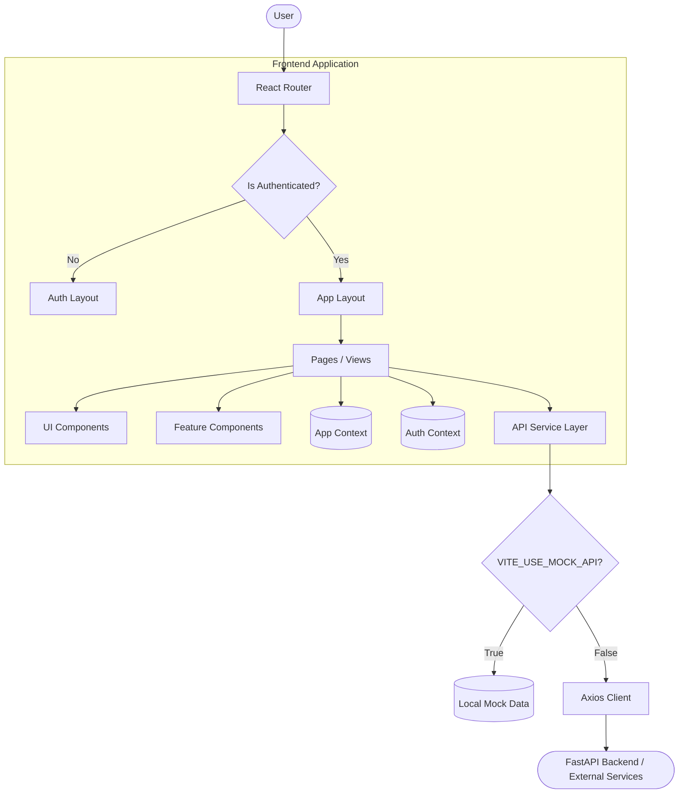
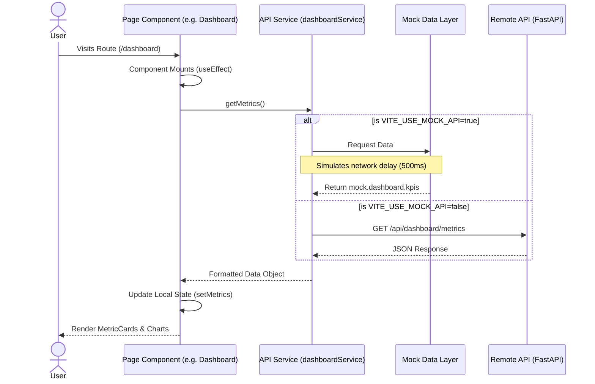

# Architecture & Data Flow

## 1. System Architecture

The ChurnGuard frontend is a single-page application (SPA) built with React. It follows a feature-centric, modular architecture designed for scalability and separation of concerns.



### Major Components
1. **Routing Layer (`src/routes/index.jsx`)**: Manages navigation, lazy loads page components for performance, and enforces route protection via `AuthRoute` and `ProtectedRoute` wrappers.
2. **Layouts (`src/layouts/`)**: Provides structural wrappers (`AppLayout`, `AuthLayout`) that persist across route changes, managing the sidebar, header, and mobile navigation.
3. **State Management (`src/context/`)**: Utilizes React Context for global state that doesn't belong to a specific page (e.g., authentication tokens, global toasts, sidebar toggle state).
4. **Service Layer (`src/services/api.js`)**: Abstracts all data fetching. It intelligently routes requests to either local mock data or a remote API based on environment configuration.
5. **UI Component Library (`src/components/ui/`)**: A bespoke suite of reusable components (`Button`, `Card`, `Modal`, `Input`, etc.) adhering to the brand's design system.

## 2. Project Structure

```
project/
├── src/
│   ├── assets/          # Static assets (images, icons)
│   ├── components/      # Shared components
│   │   ├── ui/          # Core design system components (Button, Card, Input)
│   │   └── ...          # Composite components (SearchCommand)
│   ├── context/         # React Context providers (AuthContext, AppContext)
│   ├── features/        # Feature-specific components (e.g., notifications)
│   ├── layouts/         # Page layout wrappers (AppLayout, AuthLayout)
│   ├── mock/            # Extensive mock datasets for local development
│   ├── pages/           # Route-level view components (Dashboard, Explainability)
│   ├── routes/          # Application routing configuration
│   ├── services/        # API integration layer (api.js)
│   ├── utils/           # Helper functions (helpers.js for formatting/colors)
│   ├── App.jsx          # Root React component connecting providers
│   ├── main.jsx         # Application entry point
│   └── index.css        # Tailwind config and global CSS variables
├── index.html           # HTML template
├── vite.config.js       # Vite configuration
└── package.json         # Dependencies and scripts
```

## 3. Core Components and Modules

### API Service Layer (`src/services/api.js`)
- **Purpose**: Centralizes all asynchronous data fetching and abstracts the backend environment.
- **Responsibilities**:
  - Checks `VITE_USE_MOCK_API`.
  - Simulates network latency when using mock data.
  - Exposes domain-specific services (`authService`, `dashboardService`, `customerService`, `explainabilityService`, etc.).
- **Dependencies**: Uses `axios` (when not in mock mode) and imports from `src/mock/*.js`.

### Authentication Context (`src/context/AuthContext.jsx`)
- **Purpose**: Manages user session state.
- **Responsibilities**:
  - Handles login, signup, and logout operations.
  - Persists session (using `localStorage` or session tokens).
  - Provides the current `user` object to the application tree.

### App Context (`src/context/AppContext.jsx`)
- **Purpose**: Manages global UI state.
- **Responsibilities**:
  - Controls sidebar collapse state.
  - Manages the global toast notification system (add/remove).
  - Toggles the `SearchCommand` (Ctrl+K menu) and Presentation Mode.

## 4. Data Flow

The application follows a unidirectional data flow typical of React applications, utilizing the service layer as the boundary between the UI and data sources.


